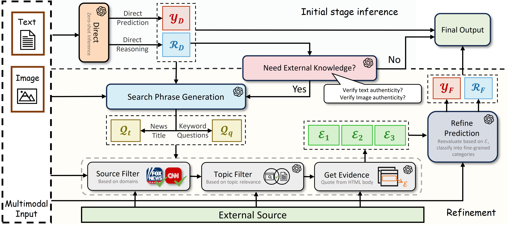

# LEMMA
An effective and explainable way to detect the multimodal misinformation with LVLM and external knowledge augmentation, incorporating the intuition and reasoning capbility inside LVLM.

[](https://opensource.org/licenses/MIT)


## Table of Contents
- [Publication](#Publication)
- [Framework](#Framework)
- [Get Started](#getstarted)
- [Dataset](#dataset)
- [Baseline](#baseline)
- [Citation](#citation)

# <a name="Publication"></a>Publication
This is the offical repository for <a href="https://arxiv.org/abs/2402.11943">LEMMA: Towards LVLM-Enhanced Multimodal Misinformation Detection with External Knowledge Augmentation</a>


# <a name="Framework"></a>Framework
<p align="center" width="100%">
    <a></a>
</p>


# Get Started
#### Install

```shell
pip install -r requirements.txt
```
#### Example Run
```
python lemma.py --input_file_name example_input.json --use_online_image --resume
```

# <a name="dataset"></a>Dataset

To assess the performance of LEMMA, we mainly evaluate its performance on two representative datasets in the field.
- ***Twitter*** (Ma et al., 2017) collects multimedia tweets from Twitter platform. The posts in the dataset contain textual tweets, image/video attachments, and additional social contextual information. For our task, we filtered out only image-text pairs as testing samples. <a href="https://github.com/fan19-hub/LEMMA/blob/main/data/twitter/twitter.json">Twitter dataset</a> is available for downloading. You can also access the raw data <a href="">here</a>
- ***Fakeddit*** (Nakamura et al., 2019) is designed for fine-grained fake news detection. The dataset is curated from multiple subreddits of the Reddit plat form where each post includes textual sentences, images, and social context information. The 2-way categorization for this dataset establishes whether the news is real or false. <a href="https://github.com/fan19-hub/LEMMA/blob/main/data/fakereddit/FAKEDDIT.json">Fakeddit dataset</a> is available for downloading. You can also access the raw data <a href="">here</a>

# Baselines

To be continued

# Citation
To cite this work, please follow the citation format below

```bibtex
@article{xuan2024lemma,
  title={LEMMA: Towards LVLM-Enhanced Multimodal Misinformation Detection with External Knowledge Augmentation},
  author={Xuan, Keyang and Yi, Li and Yang, Fan and Wu, Ruochen and Fung, Yi R and Ji, Heng},
  journal={arXiv preprint arXiv:2402.11943},
  year={2024}
}

```
