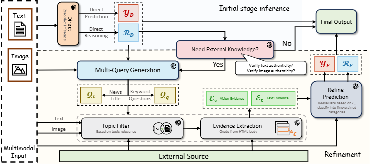

# LEMMA
An effective and explainable way to detect the multimodal misinformation with LVLM and external knowledge augmentation, incorporating the intuition and reasoning capbility inside LVLM.

[](https://opensource.org/licenses/MIT)

## Table of Contents
- [Publication](#Publication)
- [Framework](#Framework)
- [Get Started](#getstarted)
- [Dataset](#dataset)
- [Baselines](#baselines)
- [Citation](#citation)

# <a name="Publication"></a>Publication
This is the offical repository for <a href="https://arxiv.org/abs/2402.11943">LEMMA: Towards LVLM-Enhanced Multimodal Misinformation Detection with External Knowledge Augmentation</a>


# <a name="Framework"></a>Framework
<p align="center" width="100%">
    <a></a>
</p>


# <a name="getstarted"></a>Get Started
#### Install Dependency
```shell
pip install -r requirements.txt
```


#### Chrome Driver
Open your chrome and check its version here: <a> chrome://settings/help </a>
Find the chromederver suitable for your chrome version here: https://googlechromelabs.github.io/chrome-for-testing/#stable, put it under the root directory of this project

#### OpenAI API Key
Please register for an API Key on https://platform.openai.com/api-keys.
Then set up the environment variable
For Linux, run:
```shell
export OPENAI_API_KEY=<Your own API Key>
```
For Windows, run:
```bash
$env:OPENAI_API_KEY = "<Your own API Key>"
```

#### Example Run
Run the exmaple input
```
python lemma.py --input_file_name data/example_input.json --use_cache
```

Run Twitter Dataset
```
python lemma.py --input_file_name data/twitter/twitter.json --use_cache
```

# <a name="dataset"></a>Dataset

To assess the performance of LEMMA, we mainly evaluate its performance on two representative datasets in the field.
- ***Twitter*** (Ma et al., 2017) collects multimedia tweets from Twitter platform. The posts in the dataset contain textual tweets, image/video attachments, and additional social contextual information. For our task, we filtered out only image-text pairs as testing samples.
- ***Fakeddit*** (Nakamura et al., 2019) is designed for fine-grained fake news detection. The dataset is curated from multiple subreddits of the Reddit plat form where each post includes textual sentences, images, and social context information. The 2-way categorization for this dataset establishes whether the news is real or false.

# <a name="baselines"></a>Baselines
|Models|Twitter|Fakeddit|
|--|--|--|
|Direct (LLaVA)  | 0.605 | 0.663
|CoT (LLaVA)     | 0.468 | 0.673
|Direct (InstructBLIP)   | 0.494 | 0.726
|CoT (InstructBLIP) | 0.455 | 0.610
|Direct (GPT-4)  | 0.637 | 0.677
|CoT (GPT-4)     | 0.667 | 0.691
|FacTool (GPT-4) | 0.548 | 0.506
|Direct (GPT-4V) | 0.757 | 0.734
|CoT (GPT-4V)    | 0.678 | 0.754
|**LEMMA** (our model)      | 0.824 | 0.828

# Citation
To cite this work, please follow the citation format below

```bibtex
@article{xuan2024lemma,
  title={LEMMA: Towards LVLM-Enhanced Multimodal Misinformation Detection with External Knowledge Augmentation},
  author={Xuan, Keyang and Yi, Li and Yang, Fan and Wu, Ruochen and Fung, Yi R and Ji, Heng},
  journal={arXiv preprint arXiv:2402.11943},
  year={2024}
}

```
